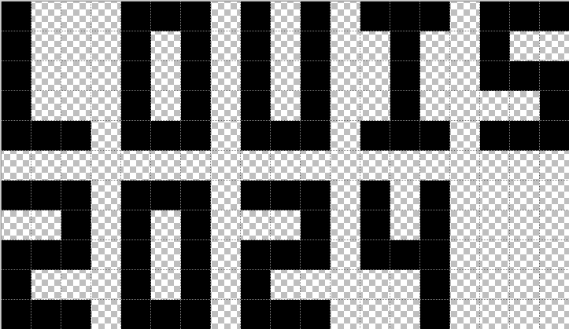
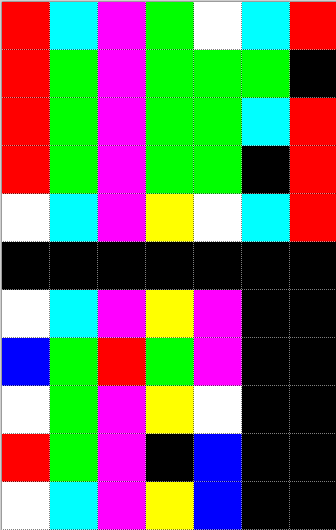
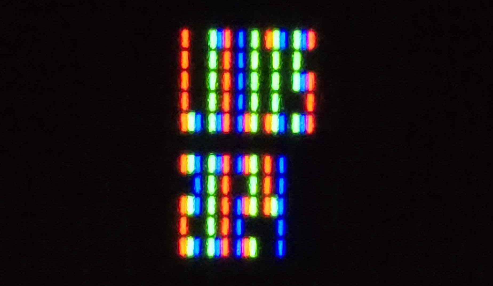
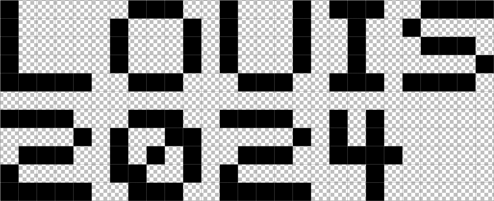
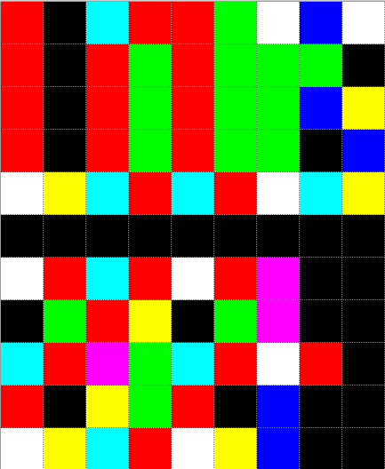
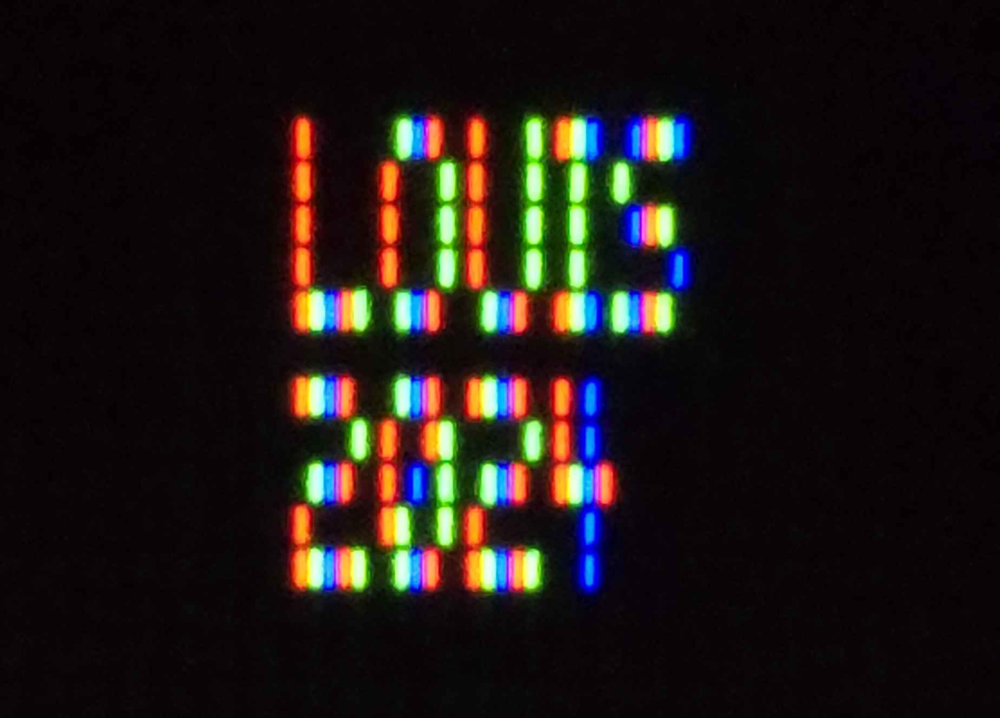
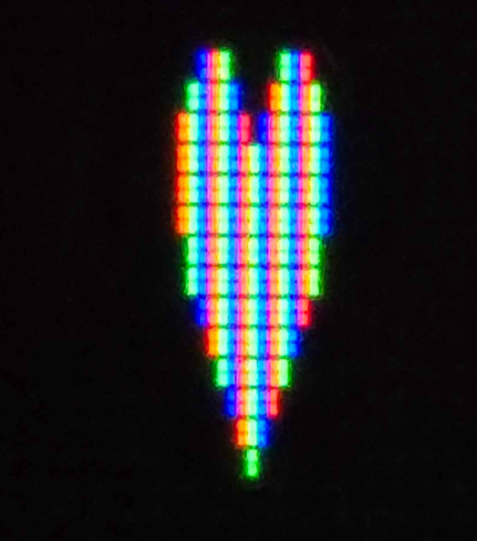
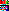
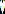

# SubPixelArt
A script that converts any image into sub pixel art for traditional LCD monitors, inspired by https://www.msarnoff.org/millitext/

This effect is most visually effective when the condensed images/icons have a lower pixel width.
## Demo
Scaled up image of our input.

Scaled up image of our output.

The output image when viewed under macro lense on a LCD monitor (VA)

An example of 5x5 text instead of 5x3 text for better visual results!

A heart just for fun :)

All the original sized images:

